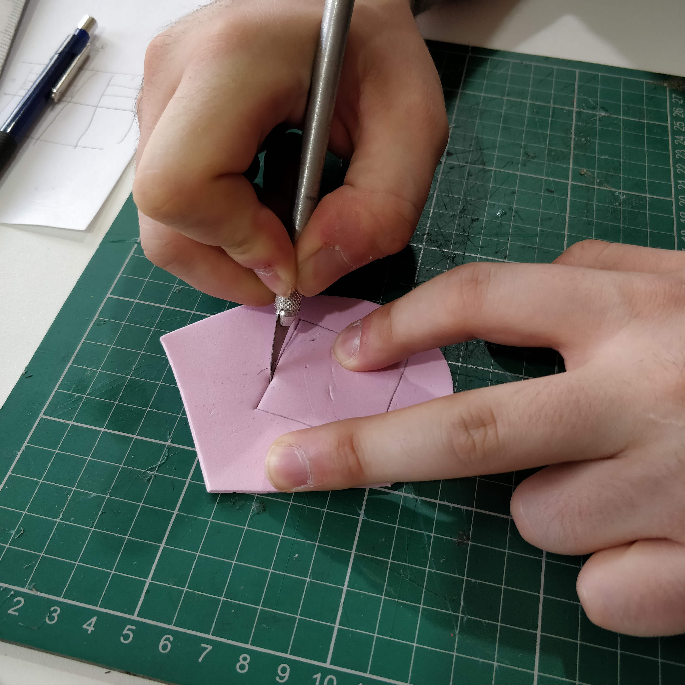
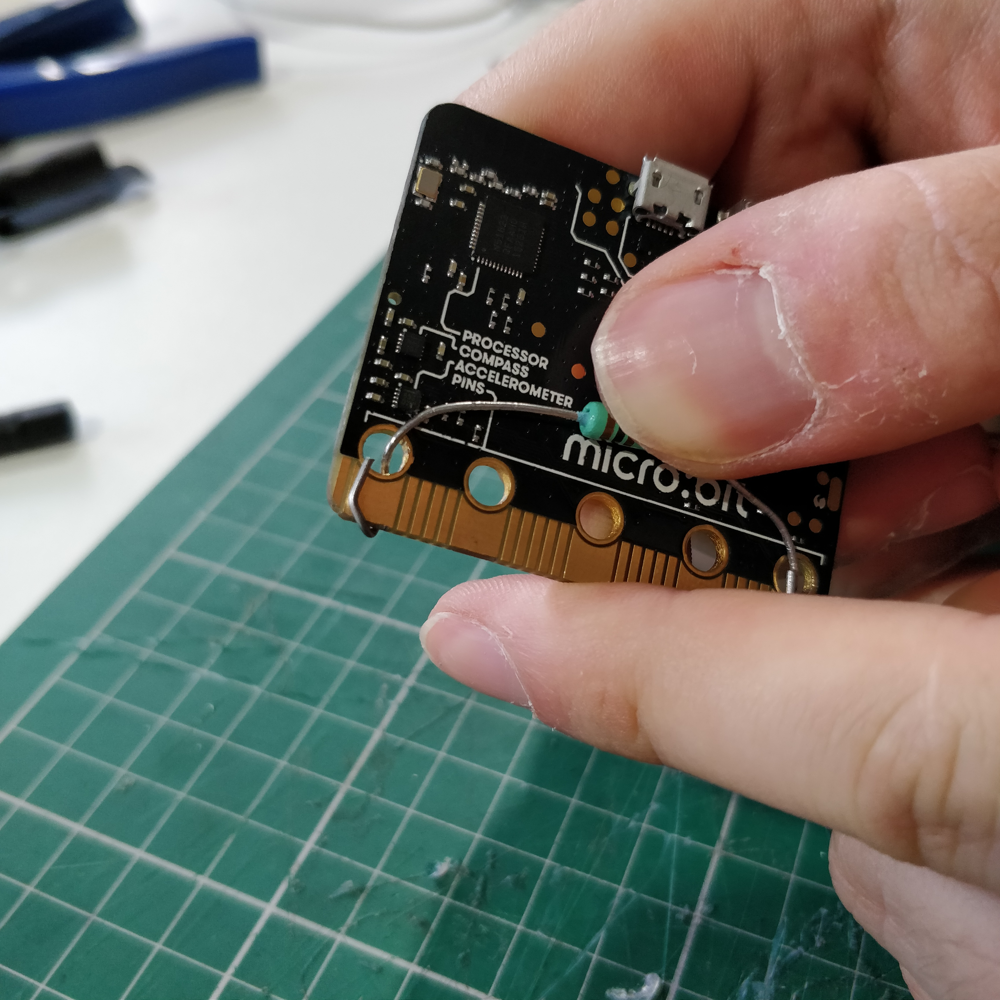

# Making a heel pressure sensor

Cut out a heel-shaped piece of foam.

Cut out a 3.5cm × 14cm strip of Velostat, then fold in half, then half again, making a square.

Place the square of Velostat on the foam heel, and draw around it.

Cut out the square you’ve just drawn.

Measure out two pieces of stranded wire, roughly 30cm long.

Strip roughly 2cm of insulation off both ends of both wires.

Stick a square of duct tape over one side of the hole in the foam heel.

Turn the foam heel over, and stick one of the wires onto the exposed tape, with the strands nicely spread out.

Place the folded square of Velostat on top.

Then place the second wire on top, with the strands spread out, as before.

And stick it all down with another square of duct tape.

Twist the ends of the two loose wires.

Turn your microbit over, so you can see the back (the side without the buttons or LEDs). Bend the legs of the 100Ω resistor through the “0“ and “GND” holes of the microbit.

Bend the ends of the legs, to hold the resistor in place.

Turn the microbit back over, and hook one of the wires from your pressure sensor through the hole marked “3V”.

Put an M3 bolt through the hole…

…And screw a nut onto the bolt, from the back of the microbit. When you’re finished, the nut and bolt should hold the wire tightly in place.

Bend the end of the final loose wire through the hole marked “0”…

…Then insert a bolt, and fasten a nut onto the back, just as before. Remember to tighten it, so that the wire is held securely in place.

Plug the battery pack into the white socket on the top of your microbit.

Write this code at <https://makecode.microbit.org>

Download the code has a Hex file, and copy the Hex file onto your microbit.

When you press the pressure sensor, the lights on your microbit should light up.
