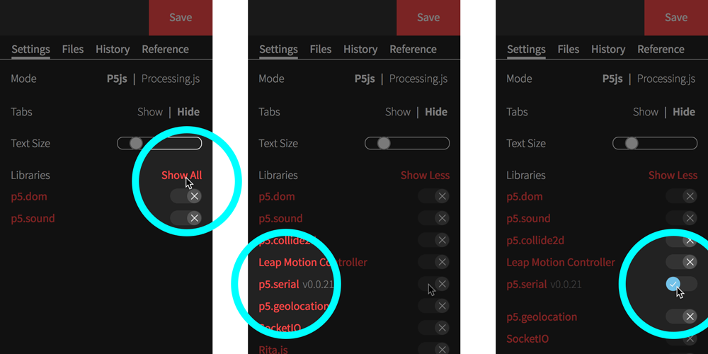

# Reading serial data from a microbit, in Processing (p5.js)

Processing is a family of libraries for drawing shapes on a screen in response to input events and data.

There are Processing libraries in a number of languages—Java, Python, JavaScript. We’re going to use <openprocessing.org> to let us run and view Processing scripts in JavaScript, using the p5.js library.

## Setting up your computer

1. Get your microbit, and plug it into your computer, using a USB cable.

2. **If you’re on a Windows PC,** you will need to [download and install the MBED Serial Driver, here](https://os.mbed.com/handbook/Windows-serial-configuration).

3. Code running in a browser cannot access your computer’s serial port. So we need to install a simple little application that will allow the serial data from your microbit to reach the scripts running in your browser.

   **If you’re on a Mac,** [download this Zip file](https://github.com/vanevery/p5.serialcontrol/releases/download/0.0.6/p5.serialcontrol-darwin-x64.zip) and run the `p5.serialcontrol.app` from inside it.

   **If you’re on a PC,** [download this Zip file](https://github.com/vanevery/p5.serialcontrol/releases/download/0.0.5/p5.serialcontrol-win32-x64.zip) and run the `p5.serialcontrol.exe` from inside it. When it opens, you will need to press the Escape button twice, until you see the full interface appear in the window.

## Writing the Processing code

1. Create an account on [openprocessing.org](https://openprocessing.org) by pressing the “Join” button and entering your details.

2. Once you’re signed up / logged in, press “Create a sketch”

3. Press “Show all” in the “Libraries” section of the sidebar, and press cross next to “p5.serial” to turn it into a tick.

   

4. Replace the starter code with this:

```js
var serial
var inData

var r
var sensorInput
var iteration = 0
var circleDiameter = 20

// Angle and step size
var theta = 0
var theta_step_angle = 0.01

var options = {
  baudrate: 115200
}

function setup () {
  colorMode(HSB)
  createCanvas(800, 800)
  background(0)

  r = height * 0.45

  // Make a new instance of the serialport library
  serial = new p5.SerialPort()
  serial.on('data', onSerialData)
  serial.on('error', onSerialError)

  // Automatically open a connection to the first serial device we find
  serial.on('list', function (list) {
    console.log(list);

    // Remove the Bluetooth device that appears on a Mac
    list = list.filter(function (device) {
      return device.indexOf('Bluetooth-Incoming-Port') === -1
    })

    if (list.length) {
      serial.open(list[0], options)
      serial.clear()
    }
  })

  serial.list()
}

function draw () {
  // Translate the origin point to the center of the screen
  translate(width/2, height/2)

  // Convert polar to cartesian
  var x = r * sensorInput * cos(theta)
  var y = r * sensorInput * sin(theta)

  // Pick a colour, based on how long the script has been running
  fill(iteration % 360, 255, 100)

  // And draw a circle, in that colour, at the right position
  ellipseMode(CENTER)
  noStroke()
  ellipse(x, y, circleDiameter, circleDiameter)

  theta += theta_step_angle
  iteration += 0.1
}

function onSerialData () {
  var inString = serial.readLine().trim()
  if (inString.length > 0) {
    sensorInput = map(Number(inString), 0, 400000, 0.25, 1)
    inData = inString
  }
}

function onSerialError(err) {
  println('Something went wrong with the serial port. ' + err)
}

function keyPressed() {
  // You can press the down arrow to download an copy of the visualisation
  if (keyCode === DOWN_ARROW) {
    saveCanvas("image", "jpg")
  }
}
```

5. If you have problems, make sure you’re using Chrome. Firefox and Safari will block the websocket connection from p5.serialcontrol, but Chrome is less picky.
