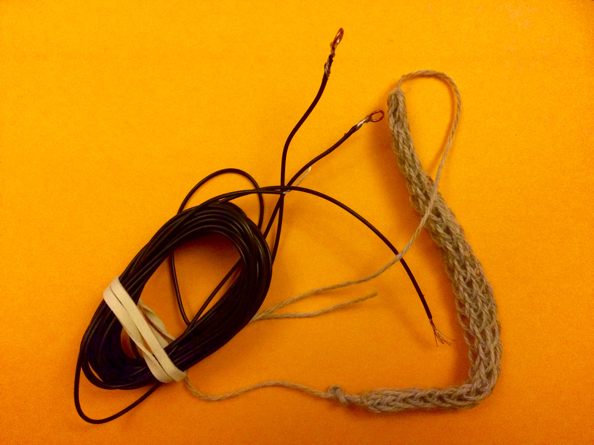
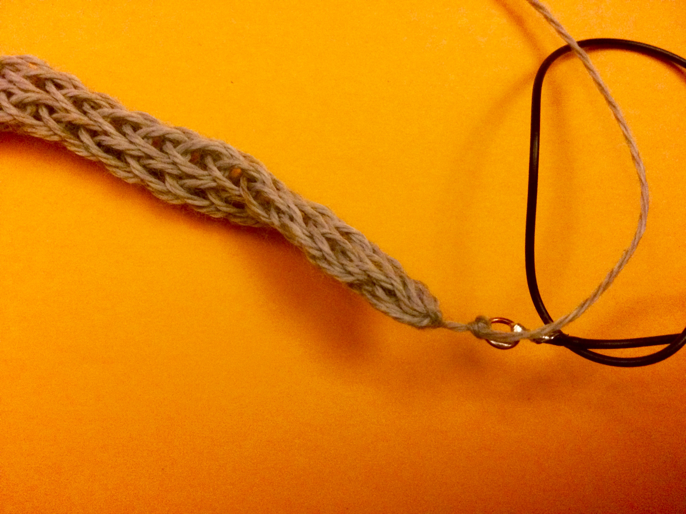
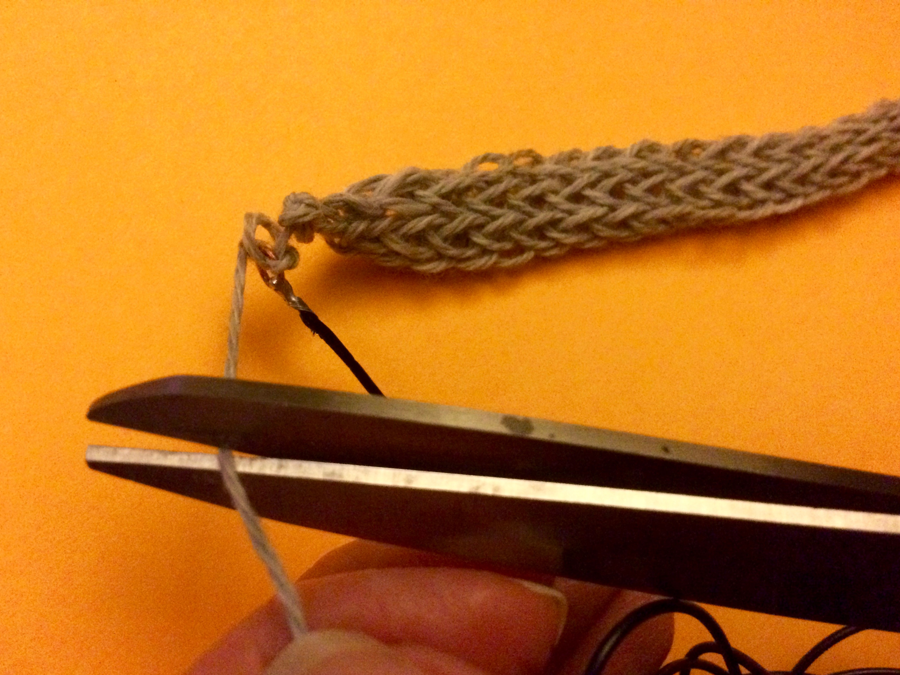
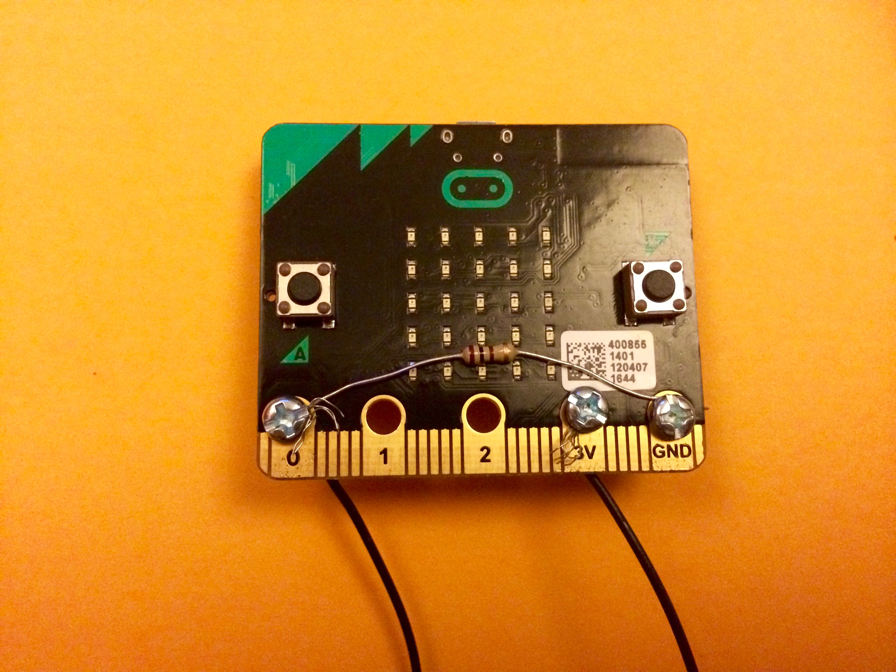
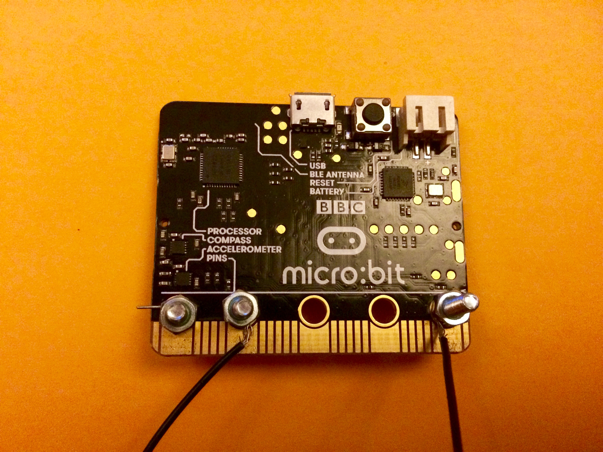

# Connecting a Pressure Sensor 

You need the pair of wires with hoops soldered on the ends and the knitted stretch sensor.

Tie one end of the stretch sensor onto one of the hoops on  one of the wires. 
Then repeat with the other end of the stretch sensor to the other hoop on the second wire.  
Make sure your knots are tight enough so that when you pull on the senosor they won't come undone.  

Cut the loose ends of the yarn  

Connect a 100ohm resistor between Pin 0 and GND and the long wires to your sensor between Pin 0 and 3V using the M3 bolts (as you did with the pressure sensor) 

