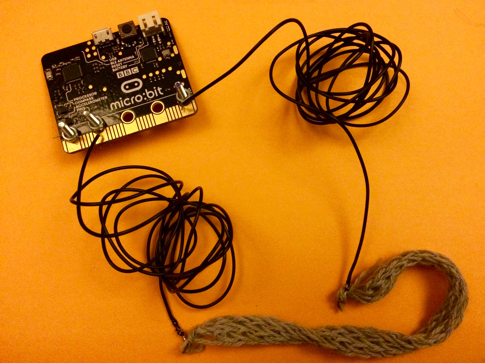

# Connecting a Pressure Sensor 

You need the pair of wires with hoops soldered on the ends and the knitted stretch sensor

Tie one end of the stretch sensor onto one of the hoops on the wires and then repeat with the other end of the stretch sensor to the other hoop on the second wire.  

